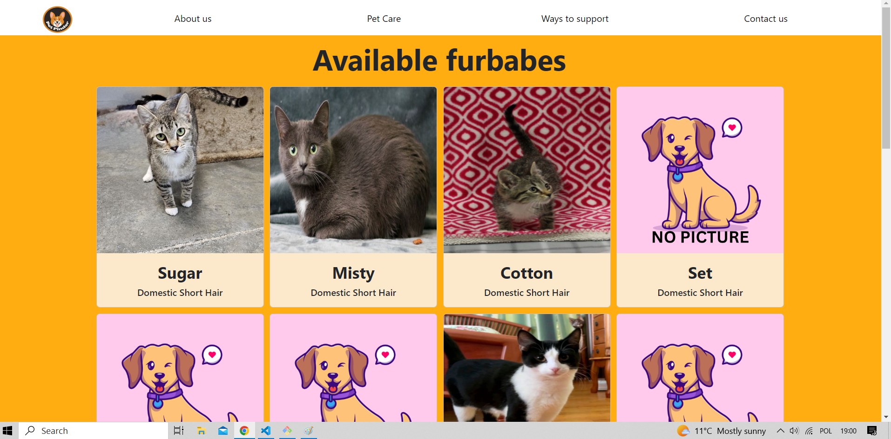
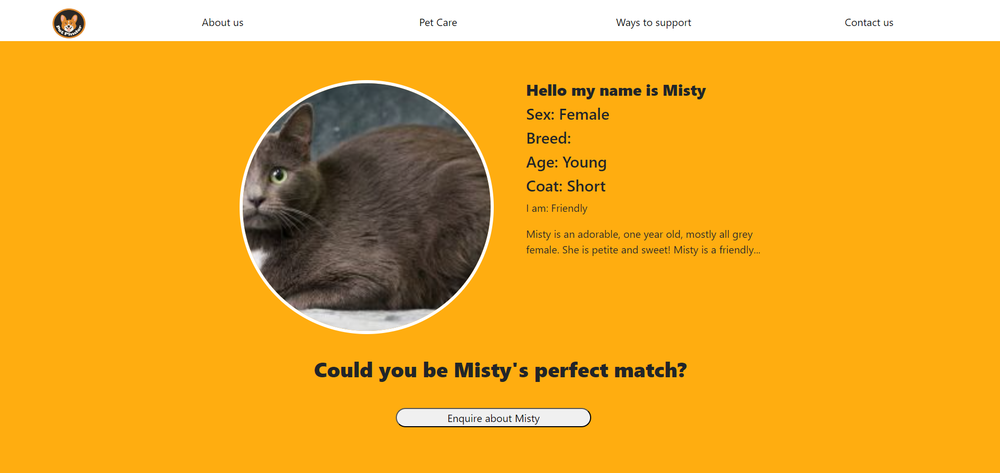

## 1. This project is called PETFINDER

Petfinder is an app designed to connect pets with their future owners. It provides a platform for people to search for pets based on location, gender, and breed, allowing them to find and rescue a life companion. With Petfinder, you can browse through thousands of pets available for adoption from over 11,500 shelters and rescues.

## 2. Project Description

The main objective of this project is to develop an application that connects to an external API and provides a user-friendly interface for displaying and searching pets. The project utilizes JavaScript (JS), React, Bootstrap, CSS, HTML, and Postman. It does not require any additional database, as it relies solely on the external API for data storage and retrieval.

## Technologies Used

- JavaScript (JS)
- React js
- Bootstrap
- CSS
- HTML
- Postman

## API

The project utilizes the Petfinder API for retrieving pet data. You can refer to the Petfinder API documentation for detailed information on the API's endpoints, parameters, and responses. Please note that the API requires a token that expires. However, the project's App.js file (lines 24-47) handles the token management.

LINK: https://www.petfinder.com/developers/

## Installation

To install the necessary dependencies, navigate to the MVP/petapp folder and run the following command:

### npm install

### Run npm start for localhost:3000

## Possible future features

The project has the potential for further enhancements and additional features, including:

- Adoption form: Provide an adoption application form for users interested in adopting a pet.
- Mini test: Incorporate a questionnaire or quiz to help users find a pet that matches their preferences.
- User login: Implement user authentication and allow users to add pets to their favorites or create personalized profiles.

## IMPORTANT create your own .env

You won't have .env file so you need to create you own env.

What to include in .env:
PETFINDER_URL= ....
REACT_APP_CLIENT_ID = ....
REACT_APP_CLIENT_SECRET = ....

## Petapp page

